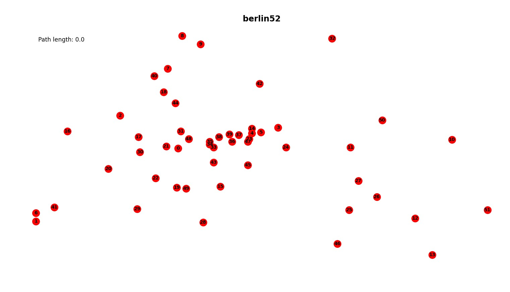
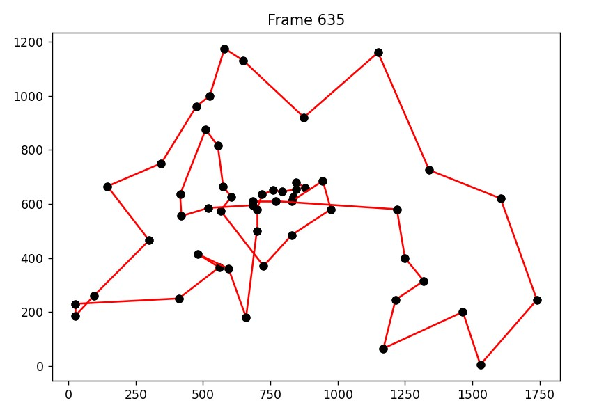
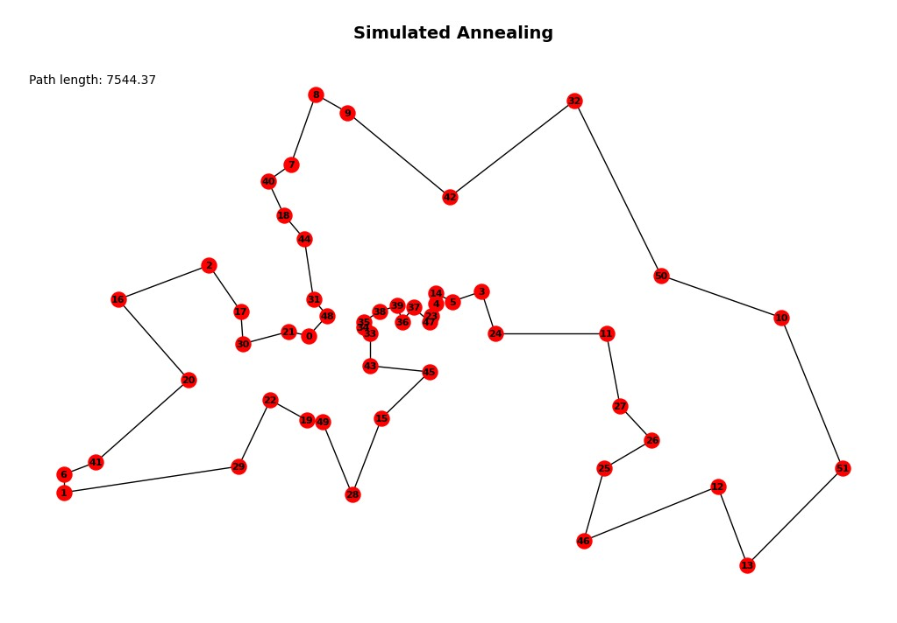
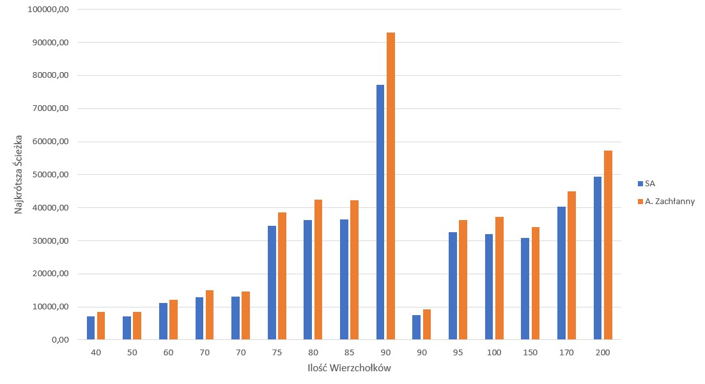
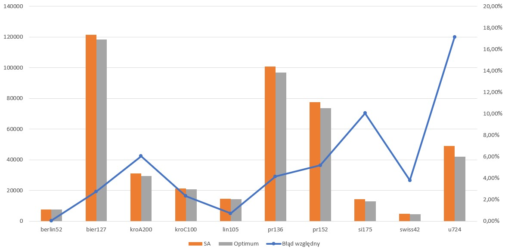

# Algorytm Wyżarzania Symulowanego

## 1. Inicjalizacja



## 2. Opis Algorytmu
Symulowane wyżarzanie – jedna z technik projektowania algorytmów heurystycznych (metaheurystyka). Cechą charakterystyczną tej metody jest występowanie parametru sterującego zwanego temperaturą, który maleje w trakcie wykonywania algorytmu. Im wyższą wartość ma ten parametr, tym bardziej chaotyczne mogą być zmiany. Podejście to jest inspirowane zjawiskami obserwowanymi w metalurgii – im większa temperatura metalu, tym bardziej jest on plastyczny.

Jest to metoda iteracyjna: najpierw losowane jest pewne rozwiązanie, a następnie jest ono w kolejnych krokach modyfikowane. Jeśli w danym kroku uzyskamy rozwiązanie lepsze, wybieramy je zawsze. Istotną cechą symulowanego wyżarzania jest jednak to, że z pewnym prawdopodobieństwem może być również zaakceptowane rozwiązanie gorsze (ma to na celu umożliwienie wyjście z maksimum lokalnego).

Prawdopodobieństwo przyjęcia gorszego rozwiązania wyrażone jest wzorem $e(f(X)−f(X'))/T$ (rozkład Boltzmanna), gdzie $X$ jest poprzednim rozwiązaniem, $X'$ nowym rozwiązaniem, a $f$ funkcją oceny jakości – im wyższa wartość $f(X)$, tym lepsze rozwiązanie. Ze wzoru można zauważyć, że prawdopodobieństwo przyjęcia gorszego rozwiązania spada wraz ze spadkiem temperatury i wzrostem różnicy jakości obu rozwiązań.

Przez rozpoczęciem wykonywania algorytmu należy ustalić:

- Początkową wartość temperatury T.
- Sposób obniżania temperatury – często stosowanym rozwiązaniem jest mnożenie aktualnej temperatury przez pewien współczynnik, zazwyczaj mieszczący się w przedziale $[0,8; 0,99]$.
- Liczbę prób przeprowadzanych w ramach jednej epoki (z tą samą temperaturą).
- Sposób wyboru nowego rozwiązania w ramach pojedynczej próby. Nowe rozwiązanie powinno znajdować się w pobliżu aktualnego. Przy wyznaczeniu nowego rozwiązania można wziąć pod uwagę aktualną temperaturę – im wyższa, tym bardziej nowe i aktualne rozwiązanie mogą się od siebie różnić.
- Warunek stopu – może to być np. osiągnięcie określonej liczby epok lub odpowiednio mała zmiana rozwiązania w trakcie ostatnio wykonanych epok.

[@debudaj-grabysz_algorytmy_2012]


## 3. Pseudokod

$S$ = instancja początkowa\
$T$ = $T_0$ = temperatura początkowa
$T_min$ = temperatura minimalna\
$alpha$ = współczynnik zmniejszania temperatury\

```python
while T > T_min
    S_New = losowy_sasiad_instancji(S)
    Delta = długość(2) - długość(S)
    if Delta < 0
        S = S_New
    else
        prawdopodobienstwo = e^(-Delta/T)
        if losowa_liczba_z_przedziału(0,1) < prawdopodobienstwo
            S = S_New
    T = T * alpha
return S
```

Nasza implementacja w języku C++ dostępna na Githubie: [Link](https://github.com/kubsnn/tsp)

## 4. Przykład obrazujący działanie


### Instancja Startowa

\

### Instancja po kilku iteracjach

\

## 5. Finalizacja

\

# Wykresy


## 1.	Porównaj optymalizowaną wartość (wynik) Algorytmu z A. zachłannym.





| Ilość Wierzchołków | SA       | A. Zachłanny |
| ------------------ | -------- | ------------ |
| 40                 | 7198.97  | 8425.74      |
| 50                 | 7193.06  | 8425.74      |
| 60                 | 11213.45 | 12106.38     |
| 70                 | 13024.65 | 14994.13     |
| 70                 | 13175.67 | 14656.53     |
| 75                 | 34553.48 | 38511.89     |
| 80                 | 36218.33 | 42364.59     |
| 85                 | 36562.34 | 42354.04     |
| 90                 | 77206.54 | 93035.40     |
| 90                 | 7559.79  | 9213.95      |
| 95                 | 32540.87 | 36239.94     |
| 100                | 31956.08 | 37165.13     |
| 150                | 30946.15 | 34221.08     |
| 170                | 40280.81 | 44911.27     |
| 200                | 49452.07 | 57311.45     |


## 2.	Korzystając z bibliotek instancji (benchmarków) pokaż na wykresie wartość błędu względnego Algorytmu w stosunku do wartości optymalnej.





| Instancja | Błąd względny | SA        | Optimum |
| --------- | ------------- | --------- | ------- |
| berlin52  | 0.03%         | 7544.37   | 7542    |
| bier127   | 2.75%         | 121530.64 | 118282  |
| kroA200   | 6.05%         | 31146.07  | 29368   |
| kroC100   | 2.33%         | 21232.84  | 20749   |
| lin105    | 0.72%         | 14482.69  | 14379   |
| pr136     | 4.16%         | 100793.86 | 96772   |
| pr152     | 5.19%         | 77508.11  | 73682   |
| si175     | 10.04%        | 14198.74  | 12903   |
| swiss42   | 3.80%         | 4766.66   | 4592    |
| u724      | 17.14%        | 49095.25  | 41910   |


[@gerhard_reinelt_optimal_2007]


## 3.	Zamieść odpowiednią do tematu część Tabelki z Rankingu instancje z Tabelki są w [katalogu]( http://www.cs.put.poznan.pl/mmachowiak/instances/)


| Instancja | Wynik     |
| --------- | --------- |
| berlin52  | 7544.37   |
| bier127   | 121530.64 |
| tsp250    | 13444.05  |
| tsp500    | 92396.16  |
| tsp1000   | 27571.37  |


# Bibliografia
