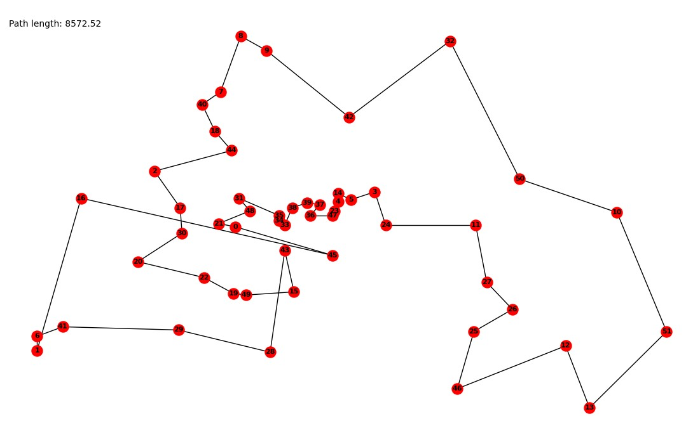

## Algorytm Wyżarzania Symulowanego

### 1. Inicjalizacja


### 2. Opis Algorytmu
Symulowane wyżarzanie – jedna z technik projektowania algorytmów heurystycznych (metaheurystyka). Cechą charakterystyczną tej metody jest występowanie parametru sterującego zwanego temperaturą, który maleje w trakcie wykonywania algorytmu. Im wyższą wartość ma ten parametr, tym bardziej chaotyczne mogą być zmiany. Podejście to jest inspirowane zjawiskami obserwowanymi w metalurgii – im większa temperatura metalu, tym bardziej jest on plastyczny.

Jest to metoda iteracyjna: najpierw losowane jest pewne rozwiązanie, a następnie jest ono w kolejnych krokach modyfikowane. Jeśli w danym kroku uzyskamy rozwiązanie lepsze, wybieramy je zawsze. Istotną cechą symulowanego wyżarzania jest jednak to, że z pewnym prawdopodobieństwem może być również zaakceptowane rozwiązanie gorsze (ma to na celu umożliwienie wyjście z maksimum lokalnego).

Prawdopodobieństwo przyjęcia gorszego rozwiązania wyrażone jest wzorem $e(f(X)−f(X'))/T$ (rozkład Boltzmanna), gdzie $X$ jest poprzednim rozwiązaniem, $X'$ nowym rozwiązaniem, a $f$ funkcją oceny jakości – im wyższa wartość $f(X)$, tym lepsze rozwiązanie. Ze wzoru można zauważyć, że prawdopodobieństwo przyjęcia gorszego rozwiązania spada wraz ze spadkiem temperatury i wzrostem różnicy jakości obu rozwiązań.

Przez rozpoczęciem wykonywania algorytmu należy ustalić:

- Początkową wartość temperatury T.
- Sposób obniżania temperatury – często stosowanym rozwiązaniem jest mnożenie aktualnej temperatury przez pewien współczynnik, zazwyczaj mieszczący się w przedziale $[0,8; 0,99]$.
- Liczbę prób przeprowadzanych w ramach jednej epoki (z tą samą temperaturą).
- Sposób wyboru nowego rozwiązania w ramach pojedynczej próby. Nowe rozwiązanie powinno znajdować się w pobliżu aktualnego. Przy wyznaczeniu nowego rozwiązania można wziąć pod uwagę aktualną temperaturę – im wyższa, tym bardziej nowe i aktualne rozwiązanie mogą się od siebie różnić.
- Warunek stopu – może to być np. osiągnięcie określonej liczby epok lub odpowiednio mała zmiana rozwiązania w trakcie ostatnio wykonanych epok.

[@debudaj-grabysz_algorytmy_2012]


### 3. Pseudokod
$S$ = instancja początkowa\
$T$ = $T_0$ = temperatura początkowa
$T_min$ = temperatura minimalna\
$alpha$ = współczynnik zmniejszania temperatury\
```python
while T > T_min
    S_New = losowy_sasiad_instancji(S)
    Delta = długość(2) - długość(S)
    if Delta < 0
        S = S_New
    else
        prawdopodobienstwo = e^(-Delta/T)
        if losowa_liczba_z_przedziału(0,1) < prawdopodobienstwo
            S = S_New
    T = T * alpha
return S
```

Nasza implementacja w języku C++ dostępna na [Githubie](https://github.com/kubsnn/tsp)

### 4. Przykład obrazujący działanie





### 5. Finalizacja


## Wykresy


### 1.	Porównaj optymalizowaną wartość (wynik) Algorytmu z A. zachłannym.

| Instancja | A. zachłanny | SA      |
| --------- | ------------ | ------- |
| Berlin52  | 8572.52      | 7544.37 |


(wykres pokaże czy Algorytm jest lepszy i o ile od A. zach.
Instancje wygenerowane losowe, 15 punktów pomiarowych)

### 2.	Korzystając z bibliotek instancji (benchmarków) pokaż na wykresie wartość błędu względnego Algorytmu w stosunku do wartości optymalnej.

(wykres pokaże jak dobry jest Algorytm,
minimum 10 instancji, wykres słupkowy)

| Instancja | Błąd względny | SA        | Optimum     |
| --------- | ------------- | --------- | ----------- |
| Berlin52  | 0.0           | 7544.37   | 7544.37     |
| Bier127   | 0.0           | 121530.64 | 118293.5238 |


### 3.	Zamieść odpowiednią do tematu część Tabelki z Rankingu instancje z Tabelki są w [katalogu]( http://www.cs.put.poznan.pl/mmachowiak/instances/)


| Instancja | Wynik     |
| --------- | --------- |
| Berlin52  | 7544.37   |
| Bier127   | 121530.64 |
| tsp250    | 13444.05  |
| tsp500    | 92396.16  |
| tsp1000   | 27571.37  |
